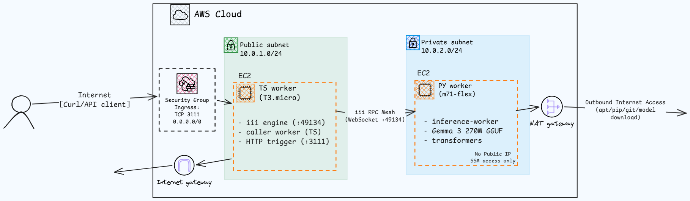

# Distributed Inference — DevOps Assignment

Deploys a Gemma 3 270M SLM behind a distributed worker mesh on AWS using Terraform. A Python worker hosts the model and exposes inference as an RPC function; a TypeScript worker fans incoming HTTP requests into that RPC and returns the result as JSON.

---

## Architecture



**RPC flow:**
1. Client sends `POST /v1/chat/completions` with JSON body → TS VM port 3111
2. `iii-http` engine worker receives the request, triggers `http::run_inference_over_http`
3. TS caller-worker calls `inference::get_response`, which triggers `inference::run_inference` on the remote Python worker via WebSocket RPC
4. Python worker loads Gemma 3 270M, applies chat template, generates tokens, returns the result
5. Response propagates back through the chain as JSON

---

## Repository Structure

```
.
├── terraform/
│   ├── provider.tf          # AWS provider config
│   ├── variables.tf         # Input variables
│   ├── networking.tf        # VPC, subnets, IGW, NAT, route tables
│   ├── security.tf          # Security groups
│   ├── iam.tf               # SSM IAM role + instance profile
│   ├── ec2.tf               # EC2 instances + user_data
│   ├── outputs.tf           # Output values (IPs, API URL)
│   └── terraform.tfvars     # Local config (gitignored)
│
├── scripts/
│   ├── ts_worker.sh         # Bootstrap for TypeScript VM
│   └── py_worker.sh         # Bootstrap for Python VM
│
├── quickstart/
│   ├── config.yaml          # iii engine config
│   ├── iii.worker.yaml      # Worker manifest template
│   ├── workers/
│   │   ├── caller-worker/   # TypeScript caller
│   │   └── inference-worker/ # Python inference
│   └── ...
│
└── README.md
```

---

## Prerequisites

- [Terraform](https://developer.hashicorp.com/terraform/downloads) >= 1.15
- [AWS CLI](https://aws.amazon.com/cli/) configured with credentials
- An [AWS account](https://aws.amazon.com/free/) (Free Tier eligible — no GPU needed)

---

## Deployment

### 1. Clone the repository

```bash
git clone <repo-url>
cd distributed-inference-devops
```

### 2. Configure Terraform variables

```bash
cat > terraform/terraform.tfvars <<EOF
aws_profile = "default"
aws_region  = "us-east-1"
environment = "dev"
EOF
```

Adjust `aws_profile` to match your AWS CLI profile name.

### 3. Deploy

```bash
cd terraform
terraform init
terraform apply
```

Terraform provisions:
- VPC (10.0.0.0/16) with public (10.0.1.0/24) and private (10.0.2.0/24) subnets
- Internet Gateway + NAT Gateway + route tables
- Security groups (public :3111, private locked to TS security group)
- IAM role + instance profile for AWS Systems Manager
- TS worker EC2 instance (public IP, t3.micro)
- PY worker EC2 instance (no public IP, m7i-flex.large)

### 4. Wait for bootstrap

After `terraform apply` completes, the instances run their user_data scripts (~5-10 minutes):
- **TS VM**: installs bun, iii engine, clones repo, starts engine, adds caller-worker
- **PY VM**: installs python3, iii engine, creates venv, installs pip deps (~2-3 min for torch), connects to remote engine, adds inference-worker

Monitor progress via SSM Session Manager or the bootstrap logs:

```bash
# Get instance IDs
terraform output ts_worker_public_ip
terraform output py_worker_private_ip

# Check logs (SSM)
aws ssm start-session --target <ts-instance-id>
sudo tail -f /var/log/ts-worker-bootstrap.log
sudo tail -f /var/log/iii-engine.log

aws ssm start-session --target <py-instance-id>
sudo tail -f /var/log/py-worker-bootstrap.log
```

### 5. Verify the API

```bash
curl -X POST http://<ts_worker_public_ip>:3111/v1/chat/completions \
  -H "Content-Type: application/json" \
  -d '{
    "messages": [
      {"role": "user", "content": "Explain quantum entanglement simply."}
    ]
  }'
```

**Example response:**

```json
{
  "result": {
    "success": "You've connected two workers and they're interoperating seamlessly, now let's add a few more workers to expand this project's functionality.",
    "response": "Quantum entanglement is a quantum physics phenomenon where two particles become linked together such that measuring one immediately influences the state of the other, regardless of distance."
  }
}
```

---

## API Reference

### `POST /v1/chat/completions`

**Request body:**

| Field | Type | Description |
|---|---|---|
| `messages` | `array[object]` | Array of message objects |
| `messages[].role` | `string` | `"user"` or `"assistant"` |
| `messages[].content` | `string` | The message text |

**Response body:**

```json
{
  "result": {
    "success": "string",
    "response": "string (generated text)"
  }
}
```

---

## Teardown

```bash
cd terraform
terraform destroy
```

This removes all provisioned resources (VPC, EC2, NAT Gateway, IAM, etc.).

---

## Security Model

- Only the TS VM has a public IP address.
- The PY VM resides in a private subnet with no public IP and no direct ingress from the internet.
- The PY security group only accepts traffic from the TS security group.
- Administrative access uses AWS SSM Session Manager — no SSH keys, no port 22 exposure.
- The API port 3111 is the only public ingress.

---

## Production Hardening

Before putting this into production, the following would be addressed:

- **TLS termination** — add an Application Load Balancer with an ACM certificate in front of the TS VM; terminate HTTPS at the ALB and forward to port 3111 as HTTP.
- **Reverse proxy** — replace direct exposure of the iii HTTP worker with Nginx or Caddy for request buffering, rate limiting, and access logging.
- **systemd units** — wrap the iii engine and each worker in systemd services with `Restart=always`, proper logging to journald, and health check hooks.
- **IAM least privilege** — restrict the EC2 instance profile to only the SSM actions needed; remove any overly permissive policies.
- **Worker health checks** — implement periodic RPC pings to each worker; deregister or restart unresponsive workers automatically.
- **Centralized logging** — ship logs to CloudWatch Logs or a dedicated Loki/ELK stack; structured JSON logging with correlation IDs.
- **Monitoring and alerting** — set up CloudWatch alarms on instance CPU, memory, and RPC latency; PagerDuty or Slack notifications on failure.
- **Autoscaling** — place the TS workers behind an ALB with an auto-scaling group; scale PY workers based on RPC queue depth.
- **Secrets management** — move any API keys, model access tokens, or database credentials to AWS Secrets Manager or Parameter Store.
- **Terraform state locking** — use an S3 backend with DynamoDB locking for collaborative IaC.
- **CI/CD** — GitHub Actions or GitLab CI to plan/apply Terraform on merge to main; automated integration tests after deployment.
- **Observability** — distributed tracing (OpenTelemetry) across the RPC chain to pinpoint latency in the TS→PY hop.

---

## Scaling to 100x Larger Models

If the model were 100x larger (e.g., 27B+ parameters):

- **GPU instances** — replace CPU instances with GPU-backed instances (e.g., g5.xlarge, p4d) for both inference and API serving. The current m7i-flex instances cannot run larger models at acceptable latency.
- **Independent scaling** — the architecture already separates API orchestration from inference, so each layer can scale independently. Put the inference workers behind an auto-scaling group triggered by RPC queue depth or GPU utilization.
- **Model sharding / tensor parallelism** — split the model across multiple GPUs using vLLM, TensorRT-LLM, or Hugging Face Accelerate. This would require multiple PY worker instances coordinated as a single inference endpoint.
- **Distributed request queueing** — replace the built-in iii queue with a more robust message broker (Redis Streams, RabbitMQ, or SQS) to buffer and prioritize inference requests across many workers.
- **Model registry / object store** — store model weights in S3 (or a model registry like MLflow) and download on-demand rather than baking them into the deployment; enables versioning, A/B testing, and rollback.
- **Orchestration** — migrate from raw EC2 to Kubernetes (EKS) or ECS with Fargate for dynamic placement, bin-packing, and resource isolation. K8s also simplifies rolling updates and canary deployments.
- **Inference caching** — introduce a semantic cache (e.g., Redis with embedding similarity) to avoid re-running inference for identical or near-identical prompts.
- **Dynamic batching** — accumulate requests over a short window and batch them into a single forward pass; dramatically improves GPU throughput.
- **Dedicated observability** — Prometheus for GPU metrics (utilization, memory, temperature), Jaeger for distributed traces across the RPC chain, and Grafana dashboards.

The current architecture's clean separation of API orchestration, inference execution, and RPC coordination would make each of these upgrades incremental rather than requiring a full rewrite.

---

## Original Source

The `quickstart/` directory was adapted from the [Alchemyst AI hiring repo](https://github.com/Alchemyst-ai/hiring/tree/main/may-2026/devops). Only the relevant worker code and config were extracted — the original repo contains additional files unrelated to this assignment. Some changes were made to `config.yaml` to match the deployment topology (host binding, port, CORS). Keeping a local copy of the quickstart code avoids pulling the full upstream repo at bootstrap time and makes it easy to apply targeted fixes without touching unrelated code.

## Known Constraints

- The iii sandbox worker runtime requires KVM virtualization for managed sandbox execution. Standard EC2 instances do not expose `/dev/kvm`. Workers are therefore executed as normal system processes (`III_SANDBOX=process`). This preserves distributed execution and RPC but removes the sandbox isolation layer.
- Model download (~600 MB GGUF file) happens at bootstrap time. First inference may be slow due to model loading into memory.
- The bootstrap scripts clone the repo from a hardcoded URL — update `scripts/ts_worker.sh` and `scripts/py_worker.sh` with your repo URL before deploying.
